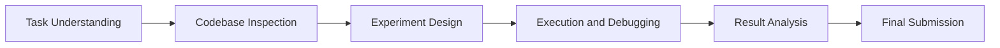
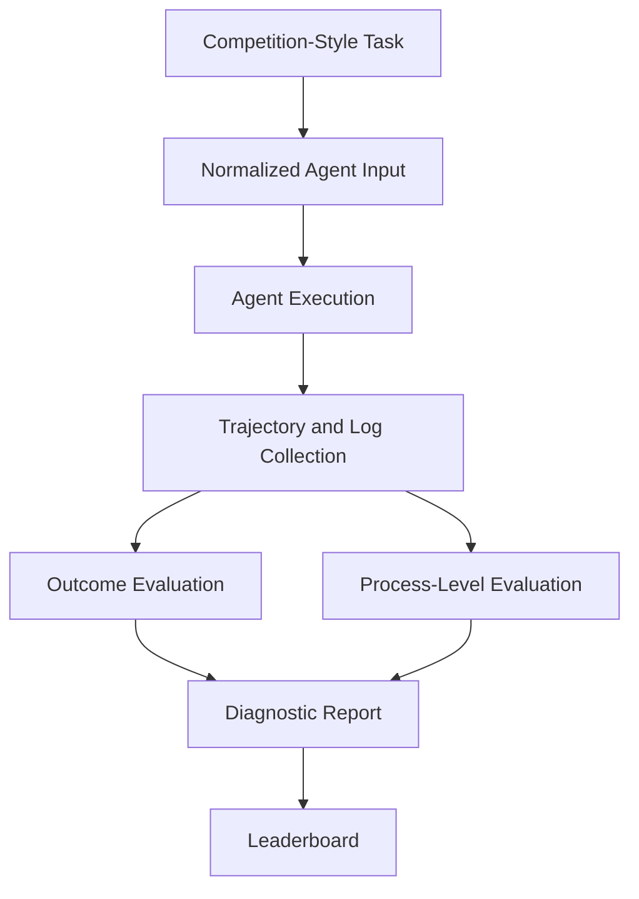

# ResearchClawArena

<p align="center">
  <b>Process-Level Evaluation of AI Scientist Agents on Real Research Tasks</b>
</p>

<p align="center">
  <a href="https://agentos-openlab.github.io/research-claw-arena/">Project Website</a> •
  <a href="https://huggingface.co/datasets/agentos-openlab/researchclaweval">Hugging Face Dataset</a> •
  <a href="#evaluated-agents">Agents</a> •
  <a href="#evaluation-status">Status</a>
</p>

---

## What is ResearchClawArena?

**ResearchClawArena** is a benchmark for evaluating whether AI Scientist agents can actually conduct research.

Most existing evaluations focus on the final output: a paper, a report, a score, or a submission. ResearchClawArena focuses on a harder question:

> Can an AI Scientist agent understand a real research task, inspect the codebase, design experiments, debug failures, iterate, and produce a valid final result?

The benchmark uses real scientific competition-style tasks and evaluates agents from two views:

1. **Outcome quality**: how good the final result is.
2. **Research process quality**: how the agent reaches that result.

---

## Why Process-Level Evaluation?

A final score alone can hide important failure modes.

An agent may obtain a reasonable result by chance, by shallow modification, or by overusing a template. Another agent may produce a weaker final score but show better task understanding, debugging behavior, and experimental reasoning.

ResearchClawArena therefore records and analyzes the full research trajectory:



---

## Highlights

- **Real research tasks** adapted from scientific competition settings.
- **Seven AI Scientist agents** evaluated under a unified protocol.
- **Full trajectory collection**, including plans, code changes, logs, errors, intermediate outputs, and final submissions.
- **Outcome and process views** for more diagnostic evaluation.
- **Open dataset release** on Hugging Face for reproducibility and secondary analysis.

---

## Evaluation Status

The current project status is:

| Component | Status |
|---|---|
| Agent execution | Completed for the current batch |
| Raw results | Generated |
| Trajectories and logs | Collected |
| Outcome analysis | In progress |
| Process-level metrics | Being finalized |
| Public leaderboard | Planned |

At this stage, the repository focuses on releasing the benchmark structure, evaluated agents, dataset organization, and evaluation protocol. The final process metrics and leaderboard will be added after metric calibration.

---

## Evaluated Agents

ResearchClawArena currently includes seven AI Scientist agents:

| Agent | Status |
|---|---|
| EvoScientist | Evaluated |
| Auto Research Claw | Evaluated |
| Deep Scientist | Evaluated |
| AI Researcher | Evaluated |
| ARIS | Evaluated |
| The AI Scientist v2 | Evaluated |
| Dr. Claw | Evaluated |

---

## Benchmark Pipeline



The goal is not only to rank agents, but also to explain why they succeed or fail.

---

## Evaluation Dimensions

The final metric set is still being calibrated. The current design follows three core dimensions:

| Dimension | What it measures |
|---|---|
| Research Grounding | Whether the agent uses task requirements, data observations, and codebase evidence to make decisions. |
| Experiment Progress | Whether the agent proposes, executes, debugs, and improves experiments. |
| Insight Utilization | Whether the agent converts intermediate results and failures into useful next-step decisions. |

These dimensions will be combined with outcome metrics to form the final leaderboard.

---

## Dataset

The released dataset is available on Hugging Face:

**https://huggingface.co/datasets/agentos-openlab/researchclaweval**

The dataset is expected to contain task information, agent outputs, execution traces, intermediate artifacts, and final results. It is designed to support both quantitative scoring and qualitative analysis of agent research behavior.

---

## Expected Repository Structure

```text
ResearchClawArena/
├── README.md
├── docs/
│   ├── metrics.md
│   ├── evaluation_protocol.md
│   └── leaderboard.md
├── results/
│   ├── leaderboard.csv
│   └── per_agent/
├── trajectories/
│   └── examples/
├── scripts/
│   ├── compute_outcome.py
│   ├── compute_process_metrics.py
│   └── build_leaderboard.py
└── assets/
    ├── pipeline.png
    ├── process_metrics.png
    └── example_trajectory.png
```

Some files are still being organized and will be released progressively.

---

## Roadmap

- [x] Run the target AI Scientist agents.
- [x] Collect raw results and research trajectories.
- [x] Release the initial project page and dataset entry.
- [ ] Finalize process-level metric definitions.
- [ ] Add public leaderboard.
- [ ] Add representative trajectory case studies.
- [ ] Add reproducible evaluation scripts.
- [ ] Add Docker-based quick start.

---

## Citation

If you use this benchmark or dataset, please cite this project. A formal citation will be added with the paper release.

```bibtex
@misc{researchclawarena2026,
  title        = {ResearchClawArena: Process-Level Evaluation of AI Scientist Agents},
  author       = {AgentOS OpenLab},
  year         = {2026},
  howpublished = {\url{https://github.com/agentos-openlab/researchclaweval}}
}
```

---

## License

The license will be clarified according to the released code, dataset, and third-party agent dependencies.
